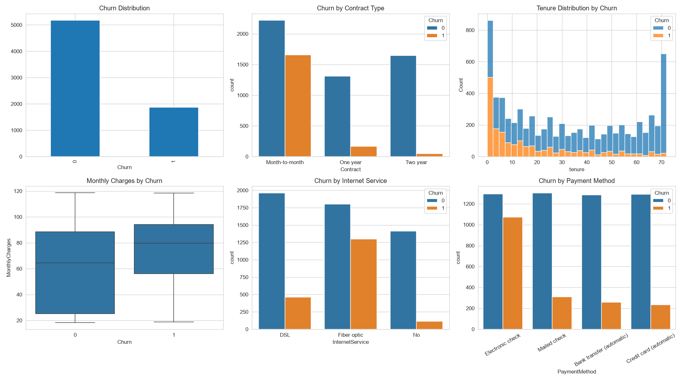
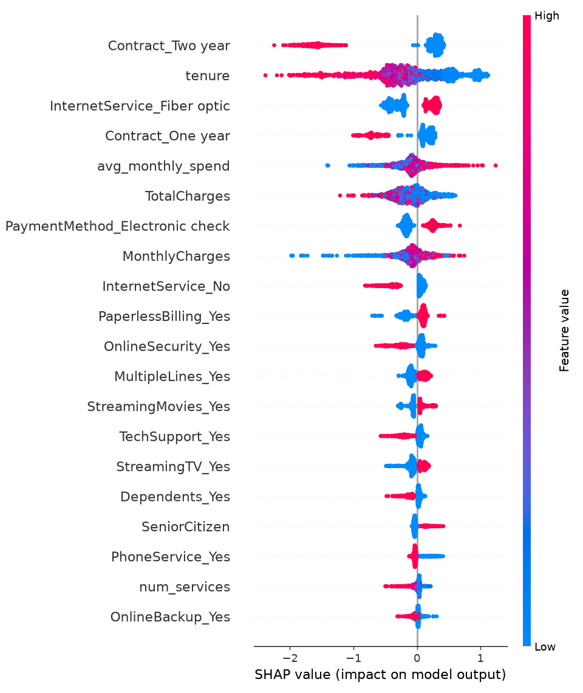

# 📉 Customer Churn Risk Prediction & Analysis

An end-to-end machine learning project that predicts which customers are likely to churn, explains *why* using SHAP, and quantifies the business impact of acting on those predictions — all built with Python.

**🔗 Live Demo:** https://customer-churn-analysis-9smmpscrbtvnjyhydiypcq.streamlit.app/

---

## Problem Statement

Customer churn — when a customer stops using a company's product or service — is one of the most costly problems for subscription-based businesses, since acquiring a new customer typically costs far more than retaining an existing one. This project builds a model that flags at-risk customers *before* they churn, so a business can proactively intervene (e.g., targeted discounts, outreach, service improvements) rather than reacting after the customer has already left.

---

## Dataset

- **Source:** [Telco Customer Churn](https://www.kaggle.com/datasets/blastchar/telco-customer-churn) (IBM sample dataset via Kaggle)
- **Size:** 7,043 customers, 21 features
- **Target:** `Churn` (Yes/No) — 26.5% churn rate (imbalanced classification problem)
- **Features:** demographics, account information (tenure, contract type, payment method), and subscribed services (internet, streaming, tech support, etc.)

---

## Tech Stack

| Category | Tools |
|---|---|
| Data manipulation | pandas, numpy |
| Visualization | matplotlib, seaborn |
| Modeling | scikit-learn (Logistic Regression), XGBoost |
| Explainability | SHAP |
| Class imbalance handling | class weighting, `scale_pos_weight` |
| Dashboard | Streamlit |
| Deployment | Streamlit Community Cloud |

---

## Project Workflow

1. **Data Cleaning** — handled a hidden data quality issue where `TotalCharges` contained blank strings (not `NaN`) for 11 brand-new customers with zero tenure; converted and imputed appropriately.
2. **Exploratory Data Analysis** — uncovered key churn drivers (below).
3. **Feature Engineering** — created `tenure_group` buckets, `num_services` (count of subscribed services), and `avg_monthly_spend`.
4. **Modeling** — trained and compared Logistic Regression (baseline) and XGBoost, both tuned for class imbalance.
5. **Explainability** — used SHAP to identify global feature importance and explain individual predictions.
6. **Business Impact Analysis** — translated model output into an actionable retention strategy.
7. **Deployment** — built and deployed an interactive Streamlit dashboard.

---

## Key EDA Insights

- **Contract type is the strongest churn driver**: month-to-month customers churn at **42.7%**, vs. **11.3%** for one-year and just **2.8%** for two-year contracts.
- **Fiber optic customers churn more** (41.9%) than DSL customers (19.0%).
- **Electronic check payers churn at 45.3%** — nearly 3x the rate of customers on automatic payment methods (15–19%).
- **Churned customers have far shorter tenure** (~18 months average) compared to retained customers (~37.6 months).

### Visual Overview


---

## Model Comparison

| Metric | Logistic Regression | XGBoost |
|---|---|---|
| Accuracy | 0.733 | 0.749 |
| Precision (Churn) | 0.498 | 0.519 |
| Recall (Churn) | 0.791 | 0.786 |
| F1 (Churn) | 0.612 | 0.625 |
| ROC-AUC | 0.842 | 0.839 |

Both models perform similarly, which suggests churn in this dataset is driven largely by strong, near-linear relationships (contract type, tenure, payment method) rather than complex non-linear interactions — the added complexity of XGBoost doesn't yield a meaningful gain here. Both models were tuned to favor **recall** for the churn class over raw accuracy, since in a retention context, failing to catch a real churner is typically more costly than a false alarm.

---

## Explainability (SHAP)

SHAP was used to move beyond a black-box prediction and identify *why* the model flags a given customer:

- **Global drivers:** contract type (especially two-year contracts, which strongly reduce churn risk), tenure, fiber optic internet, and electronic check payment method are the top predictors.
- **Individual explanations:** each customer's dashboard prediction includes a waterfall chart showing exactly which features pushed their risk score up or down — useful for a retention team deciding how to act on a specific case.

### Global Feature Importance



---

## Business Impact

Using the model's ranked churn probabilities:

> **Targeting just the top 20% highest-risk customers captures 50.8% of all customers who actually churn.**

This means a retention team could focus outreach on a fraction of the customer base while still catching over half of at-risk customers — a far more efficient use of retention budget than contacting everyone.

---

## Dashboard Features

The Streamlit app includes four sections:
1. **Overview & At-Risk Customers** — filterable table of customers ranked by predicted churn risk
2. **Model Comparison** — side-by-side metrics and ROC curve comparison between both models
3. **Business Impact** — interactive slider to explore the tradeoff between customers targeted and churners captured
4. **Explain a Prediction** — SHAP waterfall chart for any individual customer

---

## Running Locally

```bash
git clone https://github.com/JyotiKanyal08/customer-churn-analysis.git
cd customer-churn-analysis
python -m venv venv
source venv/Scripts/activate   
pip install -r requirements.txt
cd notebooks
streamlit run app.py
```

---

## Project Structure

```
customer-churn-analysis/
├── data/                       # Raw and processed datasets
├── notebooks/                  # All analysis and modeling scripts
│   ├── 01_load_and_clean.py
│   ├── 02_eda.py
│   ├── 03_feature_engineering.py
│   ├── 04_preprocessing.py
│   ├── 05_baseline_model.py
│   ├── 06_xgboost_model.py
│   ├── 07_shap_explain.py
│   └── app.py                  # Streamlit dashboard
├── outputs/                    # Saved models, plots, SHAP visualizations
├── requirements.txt
└── README.md
```

---

## Future Improvements

- Hyperparameter tuning (GridSearch/Optuna) to see if XGBoost's edge over Logistic Regression can be widened
- A/B test simulation to estimate retention-offer ROI more precisely
- Cohort/retention-curve analysis over time
- Automated model retraining pipeline

---

## Author

**Jyoti Kanyal**
B.Tech Computer Science (Data Science & Analytics) — DIT University, Dehradun

